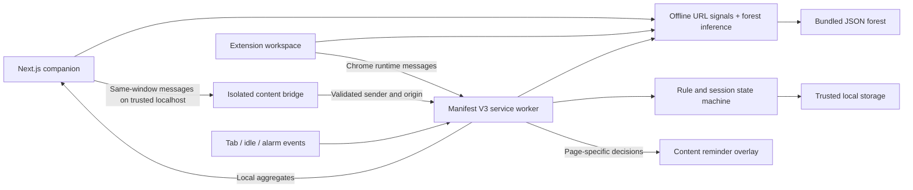

# FocusGuard: major-project presentation

## Positioning

A local-first browser extension for managing distraction during focused work, implemented with Manifest V3, event-driven state management, and privacy-preserving local analytics.

This can be presented as a substantial portfolio/major project if you can explain its implementation, run the acceptance checks, and demonstrate it reliably. The URL checker includes a supplied random forest, but do not claim validated phishing accuracy, tamper-proof blocking, or clinically validated productivity gains.

## Five-minute demonstration

1. Explain the problem: social/video sites can be useful or distracting depending on the task.
2. Start a focus session and show a blocked site and an ask-first site.
3. Choose a Deep Work, Study, or Sprint preset; show a named session intention, daily goal progress, seven-day chart.
4. Try the URL checker examples, show the true destination, the offline model result and missing-feature limits, then download its report.
5. Add a rule for the current site from the toolbar; compare ask, block, and allow, then show local export and privacy controls.

## Engineering discussion

- Why Manifest V3 service workers cannot rely on global variables or timers surviving.
- Serializing state mutations to avoid lost updates across tab, idle, and alarm events.
- Domain matching, quick rule changes, specific-rule precedence, allowance expiry, and strict validation.
- Intent-labelled sessions, configurable daily targets, seven-day local analytics, and reusable focus presets.
- An offline URL checker with a ported random forest, explicit unknown-feature bounds, and sklearn/browser prediction parity tests. Explain why certificate/content/reputation features cannot be inferred from the address alone. See URL_MODEL.md.
- Separating trusted extension controls from untrusted webpage messages.
- Approximate accounting: idle exclusion, foreground focus, midnight boundaries, and sleep gaps.
- Shadow DOM isolation and why an overlay is not a network-level block.
- Testing a pure state machine separately from Chrome APIs.

## Evidence to bring

A working unpacked extension, passing automated tests, the completed manual checklist, a short recorded demo, an architecture diagram, and examples of edge cases you fixed. Report actual measurements only; do not invent accuracy, productivity gains, or user counts.

## Future work

Optional consent-based cloud sync, proper network-level blocking with declarative rules, accessibility/user testing, and a measured study comparing usage before/after. The existing Supabase web dashboard is not automatically synchronized with the extension and should not be presented as if it is.

## Architecture at a glance

## Resume wording

See [RESUME_PROJECT.md](RESUME_PROJECT.md) for concise implementation bullets, a 90-second explanation, and the current verification record.
